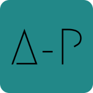

 

 
    

# Jogo Adivinhe a Palavra (AP)

- Mais De 500 Palavras;
- Objectivo, Adivinhar Uma Palavra Escolhida Aleatoriamente;
- Com Direito A Escolha De Níveis E Número De Tentativas;
- Uma Aparência Simples E Bastante Prática;

---

&copy; 2020-2022 Nurul-GC \
&trade; [ArtesGC](https://artesgc.home.blog)

