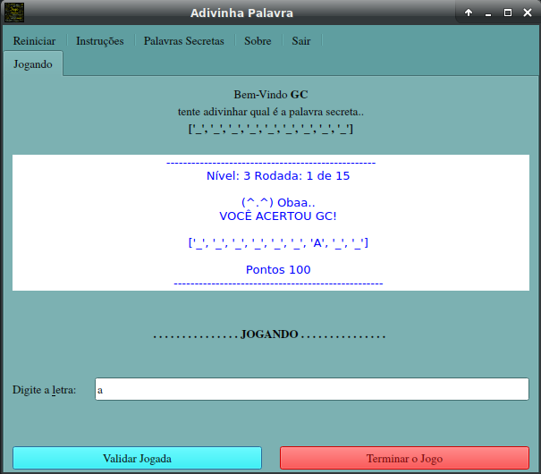
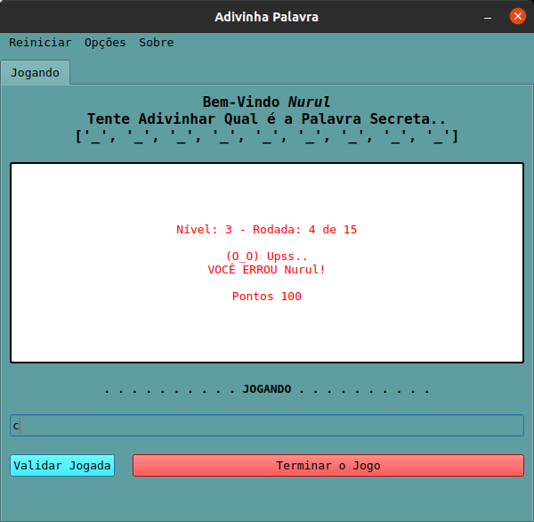
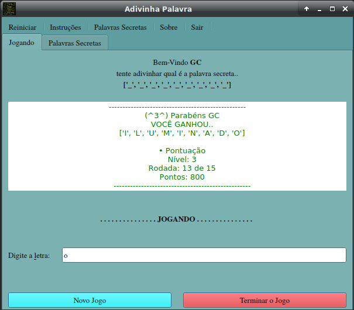
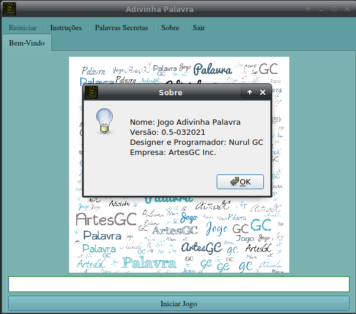

# JOGO ADIVINHE A PALAVRA

    - MAIS DE 500 PALAVRAS;
    - OBJECTIVO, ADIVINHAR UMA PALAVRA ESCOLHIDA ALEATORIAMENTE;
    - COM DIREITO A ESCOLHA DE NÍVEIS E NÚMERO DE TENTATIVAS;
    - UMA APARÊNCIA SIMPLES E BASTANTE PRÁTICA;

## Demonstrações

---

&COPY; 2019-2021 [Nurul Carvalho](mailto:nuruldecarvalho@gmail.com) \
&TRADE; [ArtesGC](https://artesgc.home.blog)
