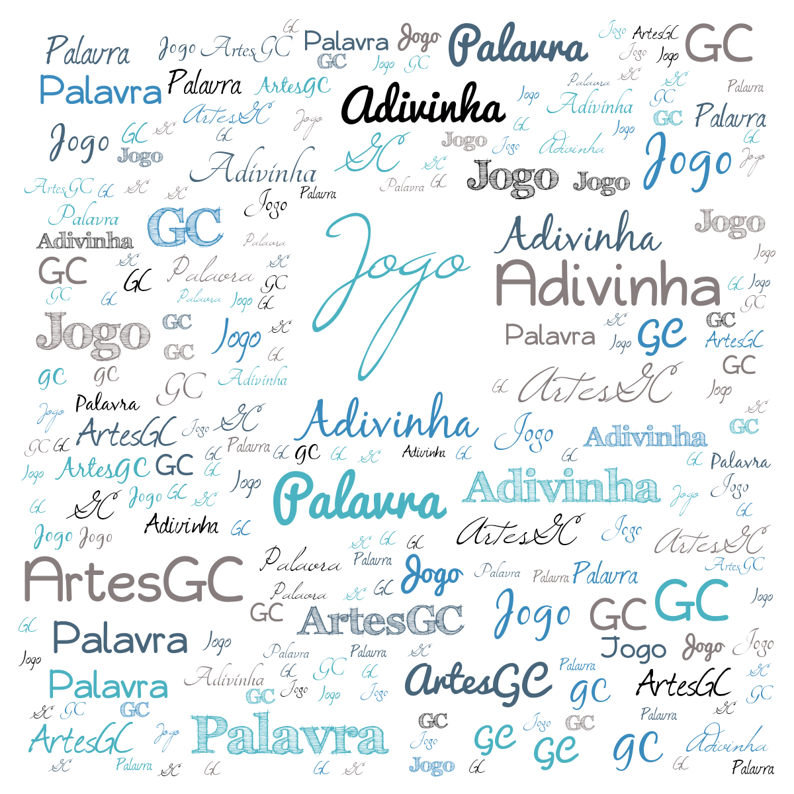

 \
 

# Jogo Adivinhe a Palavra (AP)

    - MAIS DE 500 PALAVRAS;
    - OBJECTIVO, ADIVINHAR UMA PALAVRA ESCOLHIDA ALEATORIAMENTE;
    - COM DIREITO A ESCOLHA DE NÍVEIS E NÚMERO DE TENTATIVAS;
    - UMA APARÊNCIA SIMPLES E BASTANTE PRÁTICA;

---

&trade; [ArtesGC](https://artesgc.home.blog)
