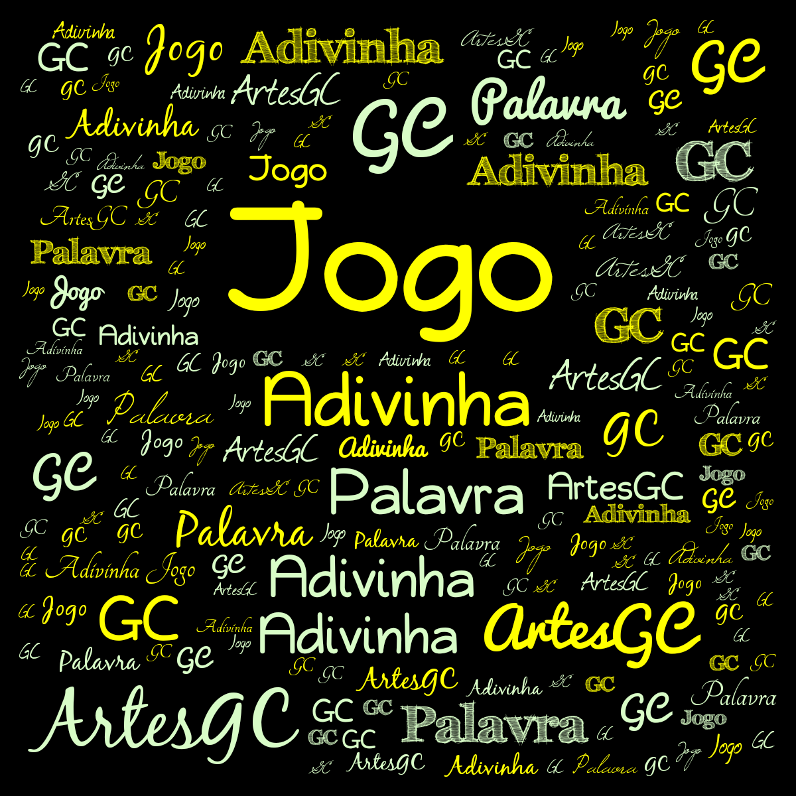
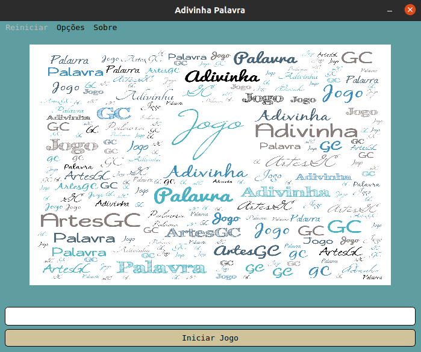
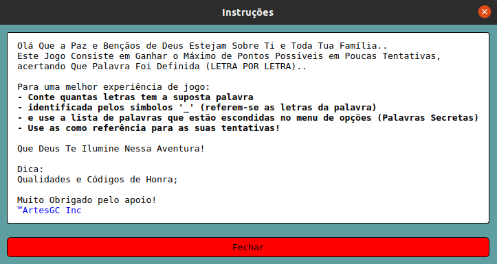
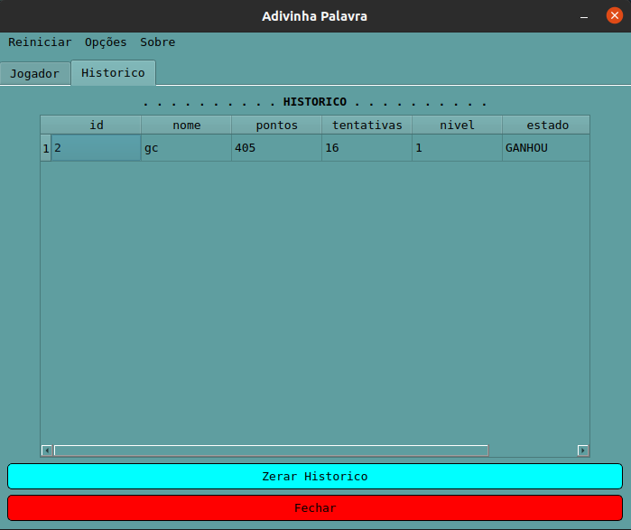
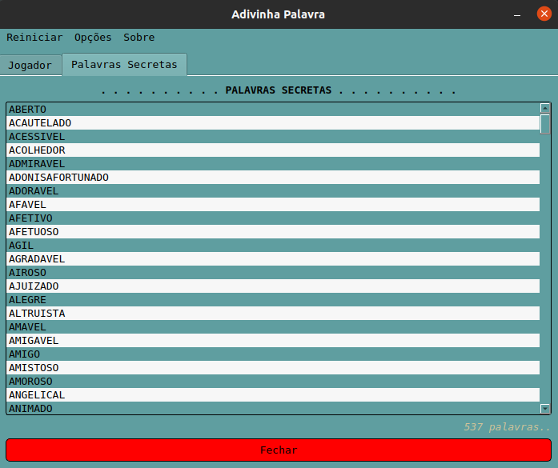
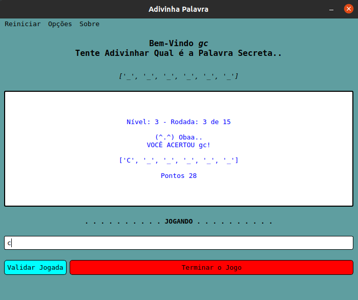
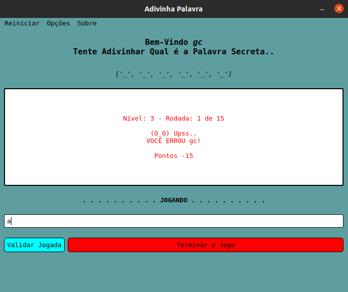
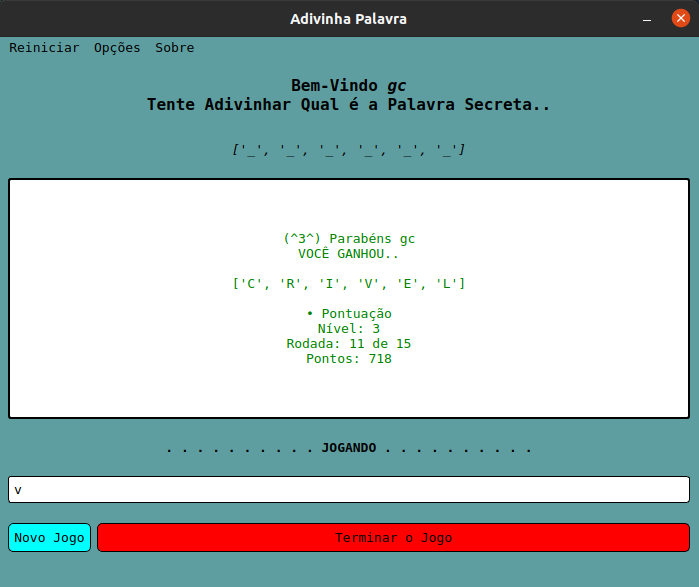
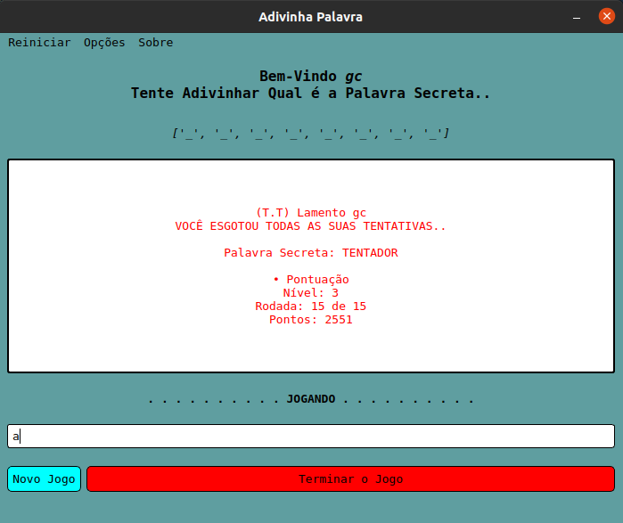
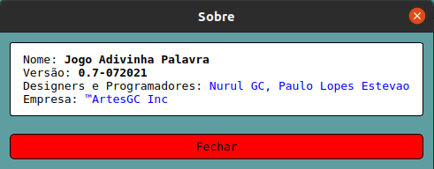

# Bem vindo a pagina de apresentacao do jogo AP (Adivinha Palavra)



```text
Com mais de 500 palavras
o jogo foi definido para quebrar a sua cabeca
tentando adivinhar que palavra foi selecionada
(por ele, automaticamente) LETRA por LETRA..

Isso mesmo letra por letra!
```

**Agora alguns exemplos da aparencia e funcionalidades do programa!**












---

&trade;ArtesGC \
&copy; 2019-2021 ArtesGC
